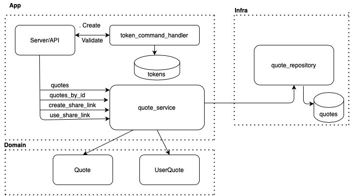
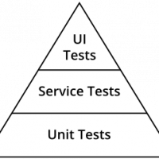

# Twain Quotes 

For the Server I use [Flask](https://flask.palletsprojects.com/en/2.0.x/) framework, to implement the transport
layer of the project.

## Hexagonal


It helps to decouple the different layers of your service(Application, Domain, Infrastructure) making it more extensible and easy to port each of the layers into another program if it's needed.

In Twain Quotes  I implemented three modules described like:

* ```Application```: Layer which normally is the entry point of your app. It has dependency with domain and infrastructure modules.
* ```Domain```: Layer where you implement the business logic of your application in your entities. It does not have any dependency.
* ```Infrastructure```: Layer where you have the persistent layer. It has dependency with domain.

## DDD

Domain Driven Design it's a design pattern for dealing with highly complex domains that is based on making the domain itself the main focus of the project.




##Testing


**To go fast you have to go well** this quote of Robert C. Martin express perfectly what TDD and BDD is. You should think first in all corner cases of your program, and then implement
one by one committing every scenario to have a quick feedback about your program.

In the application I invested mostly of the time implementing the test framework, the type of testing implemented are described below.

* ```Unit```: I used **unittest** to test all the classes of app, domain and infra .
* ```Integration```: I used **unittest** with **flask** test_client, to startup the server and test the end to end endpoints.
* ````Performance```` Probably one the most important type of testing in the pyramid. It will give you the guarantee,
that the SLA it keeps unaltered in time, and the feature has a specific performance.  It also it guarantees no concurrency issues.

## Makefile

* **build**: Create the virtual environment folder and download all dependencies specify in requirement.txt
* **test**: Pass all unit and integration test
* **performance**: Pass all performance test
* **run**: Run the ```Flask``` server
* **clean**: Delete the virtual environment folder

## Running

To run and test manually the service, you can just use the [MakeFile](Makefile) with the option run,
and then open postman and import the endpoint [collection](postman/Twain.postman_collection.json)