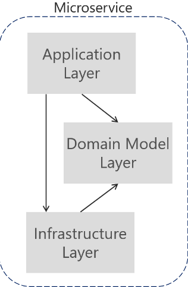

# Twain Quotes 

For the Server I use [Flask](https://flask.palletsprojects.com/en/2.0.x/) framework, to implement the transport
layer of the project.

## Hexagonal


It helps to decouple the different layers of your service(Application, Domain, Infrastructure) making it more extensible and easy to port each of the layers into another program if it's needed.

In Twain Quotes  I implemented three modules described like:

* ```Application```: Layer which normally is the entry point of your app. It has dependency with domain and infrastructure modules.
* ```Domain```: Layer where you implement the business logic of your application in your entities. It does not have any dependency.
* ```Infrastructure```: Layer where you have the persistent layer. It has dependency with domain.

##Testing


**To go fast you have to go well** this quote of Robert C. Martin express perfectly what TDD and BDD is. You should think first in all corner cases of your program, and then implement
one by one committing every scenario to have a quick feedback about your program.

In the application I invested mostly of the time implementing the test framework, the type of testing implemented are described below.

* ```Unit```: I used **unittest** to test all the classes of app, domain and infra .
* ```Integration```: I used **unittest** with **flask** test_client, to startup the server and test the end to end endpoints.

To run the test, in the root folder just run python command:
````
 python -m unittest discover
````

## Run server
* pip install Flask
* pip install pytest
* virtualenv env
* . env/bin/activate
* cd app/
* export FLASK_APP=server
* flask run

## Build

* python3 -m pip install --upgrade build
* python3 -m build